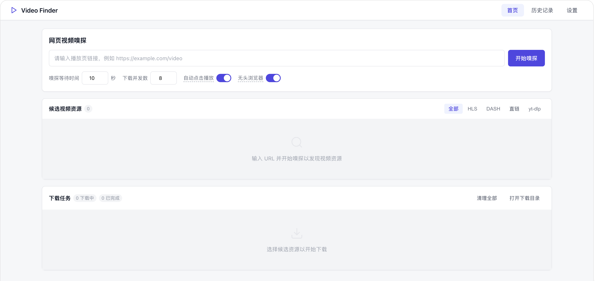

# Video Finder

本地运行的网页视频发现与下载工具，提供 Web 可视化界面和 CLI。输入播放页地址后，自动发现页面中的 HLS、DASH、直链视频等候选资源，并调用合适的下载器完成下载。



## Features

- 多策略发现：网络请求监听、HTML 扫描、播放器配置提取、yt-dlp 页面解析
- 支持常见资源类型：`m3u8`、`mpd`、`mp4`、`webm` 等
- Web 工作台 + CLI 双入口
- 实时下载进度、速度、状态展示
- 本地运行，历史记录持久化到 SQLite

## Quick Start

### Requirements

- Python 3.11+
- `yt-dlp`
- `ffmpeg`

### Install

```bash
python3 -m venv venv
source venv/bin/activate
pip install -e .
playwright install chromium
```

### Run

```bash
source venv/bin/activate
video-finder open
```

Open [http://127.0.0.1:7860](http://127.0.0.1:7860)

## Usage

### Web

1. 输入播放页 URL
2. 点击“开始嗅探”
3. 从候选资源中选择目标
4. 开始下载并查看任务进度

### CLI

```bash
video-finder sniff "https://example.com/video-page"
video-finder download "https://example.com/video-page"
```

也可以直接下载明确的资源地址：

```bash
video-finder download "https://cdn.example.com/video.m3u8"
```

## Notes

- 仅用于你有权保存的内容，例如自有素材、授权内容、公开视频、课程回放等
- 不支持绕过登录、付费限制、验证码或 DRM
- 某些站点的候选资源会依赖 `Referer`、`User-Agent` 或临时 token

## Development

```bash
pip install -e ".[dev]"
pytest
```

## License

MIT
